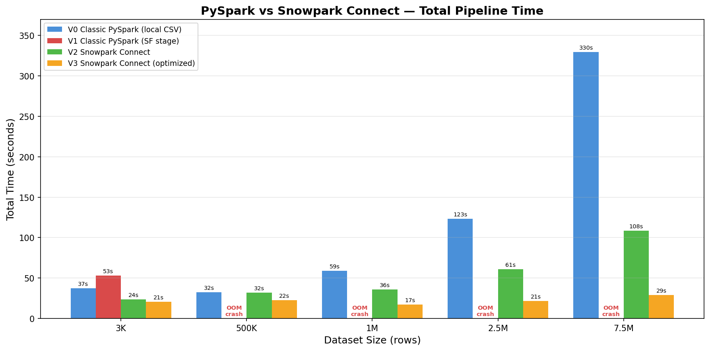

# PySpark to Snowpark Connect Migration Showcase

## Why

Migrating from classic PySpark to **Snowpark Connect** is simpler than most teams expect.
This project proves it: as a showcase an entire fraud-risk-scoring pipeline runs on four different execution
backends, and **only two functions change** between versions — `get_spark()` and `load_data()`.
Everything else — feature engineering, splitting, aggregations, write-back — stays 100% identical.

The goal is to give data engineers a concrete, runnable comparison so they can evaluate
Snowpark Connect with confidence.

## What

A fraud-risk-scoring pipeline implemented in **four versions**:

| Version | Engine | Data Source | Description |
|---------|--------|-------------|-------------|
| **V0** | Classic PySpark (`local[2]`) | Local CSV files in `./data/` | Baseline — no Snowflake dependency for data loading |
| **V1** | Classic PySpark (`local[2]`) | Snowflake stage via `snowflake.connector` | Typical pattern: fetch from stage, build DataFrame locally |
| **V2** | Snowpark Connect | Snowflake table via `spark.read.table()` | Drop-in replacement — compute runs on Snowflake |
| **V3** | Snowpark Connect (optimized) | Snowflake table via `spark.read.table()` | V2 + performance tuning (cache, projection, deferred counts) |

### System Architecture

```
                        +---------------------------------------------+
                        |              SNOWFLAKE CLOUD                 |
                        |                                              |
                        |  +--------+   +---------------------------+  |
                        |  | Stage  |   | Warehouse (compute)       |  |
                        |  | @DATA/ |   |                           |  |
                        |  | *.csv  |   |  spark.read.table()       |  |
                        |  +---+----+   |  feature engineering      |  |
                        |      |        |  split / aggregations     |  |
                        |      |        |  write-back               |  |
                        |      |        +---------------------------+  |
                        |      |              ^             ^          |
                        +------|--------------|-------------|----------+
                               |              |             |
            +------------------+---------+    |             |
            |          V1 path           |    |             |
            |  snowflake.connector       |    |             |
            |  fetchall -> local memory  |    |             |
            +------------------+---------+    |             |
                               |              |             |
  +----------------------------+--------------+-------------+--------+
  |                    LOCAL MACHINE (Apple M1 Pro, 16 GB)           |
  |                                                                  |
  |  run_v0.py    run_v1.py         run_v2.py       run_v3.py        |
  |  +-------+    +-----------+     +-----------+   +-------------+  |
  |  | V0    |    | V1        |     | V2        |   | V3          |  |
  |  | local |    | local     |     | Snowpark  |   | Snowpark    |  |
  |  | CSV   |    | PySpark + |     | Connect   |   | Connect     |  |
  |  | Spark |    | SF stage  |     |           |   | (optimized) |  |
  |  +---+---+    +-----+-----+     +-----+-----+   +------+------+  |
  |      |              |                |                 |         |
  |      v              v                v                 v         |
  |  ./data/*.csv   collectToPython   Snowflake          Snowflake   |
  |  (read local)   (OOM >= 500K)     compute            compute     |
  |                                   (pushdown)         + cache     |
  |                                                      + project   |
  +------------------------------------------------------------------+

  Data flow:
    V0:     local CSV  -->  local Spark  -->  local parquet
    V1:     SF stage   -->  local memory -->  local Spark  -->  OOM at write-back
    V2/V3:  SF table   -->  Snowflake compute (via Snowpark Connect)  -->  SF table
```

### Pipeline Steps (identical across all versions)

1. **Session init** — create a SparkSession
2. **Data load** — read raw transactions
3. **Feature engineering** — parse velocity JSON, drop PII, cast types
4. **Train/test split** — 75/25, seed=42
5. **Aggregation statistics** — fraud rate by category, country, channel/device, velocity
6. **Write-back** — save engineered features

### V3 Optimizations

1. `.cache()` after feature engineering to avoid recomputation
2. Deferred `.count()` — piggybacks on cache materialization
3. Estimated train/test counts instead of expensive `.count()` calls
4. Column projection (`df.select(...)`) before aggregations (10 columns instead of 20)
5. `.unpersist()` before write to free memory

### Key Takeaway

Only **2 sections of code** differ between all versions:

```python
# 1. Session creation
# V0/V1:  SparkSession.builder.master("local[2]").getOrCreate()
# V2/V3:  snowpark_connect.init_spark_session()

# 2. Data loading
# V0:     spark.read.csv("local_file.csv")
# V1:     snowflake.connector -> fetchall -> createDataFrame
# V2/V3:  spark.read.table("TABLE_NAME")
```

The entire pipeline logic — feature engineering, splitting, aggregations, write-back —
remains **100% identical** across all four versions.

## How

### Prerequisites

**Required:**

- Python 3.12+
- PySpark 3.5+
- `snowpark-connect[jdk]` (for V2/V3)
- A Snowflake account with a named connection configured (for V1/V2/V3)
- JDK 17+ (handled automatically via `--add-opens` flags)

**Test environment (not required — listed for reproducibility):**

- Apple M1 Pro, 16 GB RAM

### Environment Variables

All Snowflake-specific references are configurable via environment variables:

| Variable | Default | Description |
|----------|---------|-------------|
| `SNOWFLAKE_CONNECTION_NAME` | `default` | Named connection from `~/.snowflake/config.toml` |
| `SF_DATABASE` | `MY_DATABASE` | Snowflake database containing the schema |
| `SF_SCHEMA` | `RISK_SCORING_MODEL` | Schema with raw transaction tables |
| `SF_STAGE` | `DATA` | Internal stage name where CSVs are uploaded |
| `DATA_SIZE` | `small` | Dataset size: `small`, `500k`, `1mio`, `medium`, `big` |

### Project Structure

```
pyspark/
├── README.md               # This file
├── config.toml.example     # Sample Snowflake CLI connection config
├── run_v0.py               # V0: Classic PySpark, local CSV
├── run_v1.py               # V1: Classic PySpark, Snowflake stage
├── run_v2.py               # V2: Snowpark Connect
├── run_v3.py               # V3: Snowpark Connect (optimized)
├── run_comparison.py        # Orchestrator: runs all versions, prints comparison
├── setup.sql               # DDL to create Snowflake tables from staged CSVs
├── comparison_results.json  # Latest comparison results (JSON)
├── comparison_output.log    # Full comparison output log
└── data/
    ├── synthetic_fraud_data_small.csv    # ~3K rows
    ├── synthetic_fraud_data_500k.csv     # ~500K rows
    ├── synthetic_fraud_data_1mio.csv     # ~1M rows
    ├── synthetic_fraud_data_medium.csv   # ~2.5M rows
    └── synthetic_fraud_data.csv          # ~7.5M rows
```

### Input Data

Source: [Kaggle — Risk Scoring Model](https://www.kaggle.com/code/lyneshiacorrea/risk-scoring-model)

Synthetic fraud transaction data with 24 columns including transaction details,
merchant info, geographic data, device/channel info, and a binary `is_fraud` label.

### Data Modes

| Mode | Rows | CSV Size | Description |
|------|------|----------|-------------|
| `small` | ~3,000 | ~1.1 MB | Quick smoke test |
| `500k` | ~500,000 | ~188 MB | Medium benchmark |
| `1mio` | ~1,000,000 | ~375 MB | Larger benchmark |
| `medium` | ~2,500,000 | ~937 MB | Stress test |
| `big` | ~7,500,000 | ~2.7 GB | Full dataset |

CSV files live in `./data/`. Snowflake tables are pre-loaded via `setup.sql`.

### Snowflake CLI Connection

Copy the sample config and fill in your credentials:

```bash
cp config.toml.example ~/.snowflake/config.toml
chmod 0600 ~/.snowflake/config.toml
# Edit ~/.snowflake/config.toml with your account, user, and password
```

See `config.toml.example` for the expected format.

The config file defines **named connections** (e.g. `default`). When running V1/V2/V3,
pass the connection name via the `SNOWFLAKE_CONNECTION_NAME` environment variable so the scripts
know which Snowflake account to target:

```bash
SNOWFLAKE_CONNECTION_NAME=default python run_v2.py --500k
```

### Setup (Snowflake objects)

```bash
snow sql -f setup.sql -c default
```

### Running a Single Version

```bash
# V0 — local CSV
python run_v0.py                    # defaults to "small"
python run_v0.py --500k

# V1 — Snowflake stage
SNOWFLAKE_CONNECTION_NAME=default python run_v1.py --500k

# V2 — Snowpark Connect
SNOWFLAKE_CONNECTION_NAME=default python run_v2.py --500k

# V3 — Snowpark Connect (optimized)
SNOWFLAKE_CONNECTION_NAME=default python run_v3.py --500k
```

### Running the Full Comparison

Set the environment variables for your Snowflake connection first:

```bash
export SNOWFLAKE_CONNECTION_NAME=NEWS_CREW_SVC
export SF_DATABASE=MD_TEST
.venv/bin/python run_comparison.py
```

Available data-size flags:

```bash
.venv/bin/python run_comparison.py              # small (~3,000 rows)
.venv/bin/python run_comparison.py --500k       # 500K rows
.venv/bin/python run_comparison.py --1mio       # 1M rows
.venv/bin/python run_comparison.py --medium     # 2.5M rows
.venv/bin/python run_comparison.py --big        # 7.5M rows
```

Results are written to `comparison_results.json` and `comparison_output.log`.

## Comparison Results



### Small (~3,000 rows)

| Step | V0 (Classic PySpark) | V1 (Classic PySpark) | V2 (Snowpark Connect) | V3 (Snowpark Connect, optimized) |
|------|---------------:|---------------:|---------------:|---------------:|
| session_init | 11.66s | 28.85s | 12.84s | 12.07s |
| data_load | 5.29s | 13.84s | 0.50s | 0.14s |
| feature_eng | 1.10s | 0.60s | 0.69s | 2.81s |
| split | 2.61s | 3.34s | 5.19s | 0.00s |
| aggregations | 5.78s | 4.16s | 2.74s | 2.96s |
| write_back | 1.19s | 0.38s | 1.44s | 2.51s |
| **TOTAL** | **37.44s** | **53.05s** | **23.51s** | **20.64s** |

> V3 is **2.6x faster** than V1 and **1.1x faster** than V2.

### 500K rows

| Step | V0 (Classic PySpark) | V1 (Classic PySpark) | V2 (Snowpark Connect) | V3 (Snowpark Connect, optimized) |
|------|---------------:|---------------:|---------------:|---------------:|
| session_init | 7.27s | 7.10s | 10.99s | 10.21s |
| data_load | 2.03s | 21.80s | 0.36s | 0.10s |
| feature_eng | 0.16s | 0.17s | 0.78s | 5.28s |
| split | 8.40s | 9.20s | 13.68s | 0.00s |
| aggregations | 5.28s | 15.37s | 1.33s | 2.48s |
| write_back | 8.79s | crashed | 4.48s | 3.98s |
| **TOTAL** | **32.44s** | **crashed** | **31.72s** | **22.50s** |

> V3 is **1.4x faster** than V2 and V0 — saving ~10 seconds.
> V1 completes steps 1–5 (53.64s) but crashes at write-back (`collectToPython` OOM via Py4J/Netty).

### 1M rows

| Step | V0 (Classic PySpark) | V1 (Classic PySpark) | V2 (Snowpark Connect) | V3 (Snowpark Connect, optimized) |
|------|---------------:|---------------:|---------------:|---------------:|
| session_init | 7.17s | 7.05s | 10.32s | 8.08s |
| data_load | 2.58s | 37.10s | 0.44s | 0.15s |
| feature_eng | 0.15s | 0.18s | 0.43s | 3.76s |
| split | 20.10s | 19.75s | 14.34s | 0.00s |
| aggregations | 11.58s | 12.00s | 1.41s | 2.57s |
| write_back | 16.62s | crashed | 8.72s | 2.56s |
| **TOTAL** | **58.88s** | **crashed** | **35.75s** | **17.30s** |

> V3 is **3.4x faster** than V0 — saving 41.6 seconds.
> V1 completes steps 1–5 (76.08s) but crashes at write-back (`collectToPython` OOM via Py4J/Netty).

### 2.5M rows

| Step | V0 (Classic PySpark) | V1 (Classic PySpark) | V2 (Snowpark Connect) | V3 (Snowpark Connect, optimized) |
|------|---------------:|---------------:|---------------:|---------------:|
| session_init | 7.27s | 8.06s | 10.73s | 8.77s |
| data_load | 3.31s | 80.91s | 0.94s | 0.11s |
| feature_eng | 0.15s | 0.27s | 0.56s | 7.16s |
| split | 43.80s | 48.61s | 16.51s | 0.00s |
| aggregations | 23.27s | 61.08s | 4.43s | 1.96s |
| write_back | 44.62s | crashed | 27.46s | 3.32s |
| **TOTAL** | **123.15s** | **crashed** | **60.73s** | **21.47s** |

> V3 is **5.7x faster** than V0 and **2.8x faster** than V2 — saving over 100 seconds.
> V1 completes steps 1–5 (198.93s) but crashes at write-back (`collectToPython` OOM via Py4J/Netty).

### 7.5M rows

| Step | V0 (Classic PySpark) | V1 (Classic PySpark) | V2 (Snowpark Connect) | V3 (Snowpark Connect, optimized) |
|------|---------------:|---------------:|---------------:|---------------:|
| session_init | 7.84s | 7.61s | 10.74s | 10.65s |
| data_load | 6.17s | 334.92s | 0.89s | 0.17s |
| feature_eng | 0.28s | 0.32s | 0.47s | 11.18s |
| split | 129.00s | 246.76s | 27.04s | 0.00s |
| aggregations | 65.93s | 256.63s | 4.92s | 2.38s |
| write_back | 119.87s | crashed | 64.29s | 4.46s |
| **TOTAL** | **329.70s** | **crashed** | **108.44s** | **28.98s** |

> V3 is **11.4x faster** than V0 and **3.7x faster** than V2 — saving over 300 seconds.
> V1 completes steps 1–5 (846.24s) but crashes at write-back (`collectToPython` OOM / Netty connection reset).

## Limitations and Notes

- **V1 OOM on large datasets:** V1 does not complete write-back for 500K+ rows due to `collectToPython` out-of-memory errors in the Py4J/Netty layer. Steps 1–5 still complete and timings are reported where available.
- **Single-machine benchmarks:** All results were collected on a single Apple M1 Pro (16 GB RAM). Production performance on larger Snowflake warehouses will differ.
- **Single-run measurements:** Timings are from individual runs, not averaged across multiple iterations. Expect variance of a few seconds between runs.

